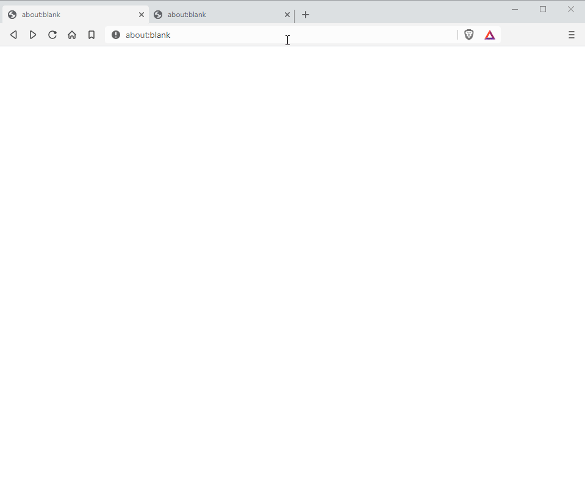

<p align='center'>
  <br />
</p>

<h2 align="center"><i>Turn your documents into data!</i></h2>

<p align="center">
	<a href="https://cloud.drone.io/axa-group/Parsr"></a>
</p>

<p align="center">
	<a href="README_fr.md">Français</a> |
  <a href="README_pt.md">Portuguese</a> |
  <a href="README_sp.md">Spanish</a> |
	<a href="README_zh-cn.md">中文</a>
</p>

<!--p align='center'>
  
</p-->

- **Parsr**, is a minimal-footprint document (**image, pdf, docx, eml**) cleaning, parsing and extraction toolchain which generates readily available, organized and usable data in **JSON, Markdown (MD), CSV/Pandas DF** or **TXT** formats.

- It provides analysis, data scientists and developers with clean structured and label-enriched information set for ready-to-use applications ranging from data entry and document analysts automation, archival, and many others.

- Currently, Parsr can perform document cleaning, _hierarchy regeneration_ (words, lines, paragraphs), detection of _headings, tables, lists, ToCs, page numbers, headers/footers, links_, and others. Check out [all the features](server/src/processing/README.md#1-current-processing-modules).

# Table of Contents

- [Table of Contents](#table-of-contents)
- [Getting Started](#getting-started) - [Installation](#installation) - [Usage](#usage)
- [Documentation](#documentation)
- [Contribute](#contribute)
- [Third Party Licenses](#third-party-licenses)
- [License](#license)

# Getting Started

## Installation

_-- The advanced installation guide is available [here](docs/installation.md) --_

The quickest way to install and run the Parsr API is through the [docker image](https://hub.docker.com/r/axarev/parsr):

```sh
docker pull axarev/parsr
```

If you also wish to install the GUI for sending documents and visualising results:

```sh
docker pull axarev/parsr-ui-localhost
```

Note: Parsr can also be installed bare-metal (not via Docker containers), the procedure for which is documented in the [installation guide](docs/installation.md).

## Usage

_-- The advanced usage guide is available [here](docs/usage.md) --_

To run the [API](docs/api-guide.md), issue:

```sh
docker run -p 3001:3001 axarev/parsr
```

which will launch it on [http://localhost:3001](http://localhost:3001).  
Consult the documentation on the [usage of the API](docs/api-guide.md).

1. To access the **python** client to Parsr API, issue:

   ```sh
   pip install parsr-client
   ```

   To sample the **Jupyter Notebook**, using the python client, head over to the [jupyter demo](demo/parsr-jupyter-demo).

2) To use the GUI tool (the API needs to already be running), issue:
   ```sh
   docker run -t -p 8080:80 axarev/parsr-ui-localhost:latest
   ```
   Then, access it through [http://localhost:8080](http://localhost:8080).

Refer to the [Configuration documentation](docs/configuration.md) to interpret the configurable options in the GUI viewer.

The [API based usage](docs/usage.md#3-api) and the [command line usage](docs/usage.md#23-command-line-usage) are documented in the [advanced usage](docs/usage.md) guide.

# Documentation

All documentation files can be found [here](docs/README.md).

# Contribute

Please refer to the [contribution guidelines](CONTRIBUTING.md).

# Third Party Licenses

Third Party Libraries licenses for its [dependencies](docs/dependencies.md):

1. **QPDF**: Apache [http://qpdf.sourceforge.net](http://qpdf.sourceforge.net/)
2. **ImageMagick**: Apache 2.0 [https://imagemagick.org/script/license.php](https://imagemagick.org/script/license.php)
3. **Pdfminer.six**: MIT [https://github.com/pdfminer/pdfminer.six/blob/master/LICENSE](https://github.com/pdfminer/pdfminer.six/blob/master/LICENSE)
4. **PDF.js**: Apache 2.0 [https://github.com/mozilla/pdf.js](https://github.com/mozilla/pdf.js)
5. **Tesseract**: Apache 2.0 [https://github.com/tesseract-ocr/tesseract](https://github.com/tesseract-ocr/tesseract)
6. **Camelot**: MIT [https://github.com/camelot-dev/camelot](https://github.com/camelot-dev/camelot)
7. **MuPDF** (Optional dependency): AGPL [https://mupdf.com/license.html](https://mupdf.com/license.html)
8. **Pandoc** (Optional dependency): GPL [https://github.com/jgm/pandoc](https://github.com/jgm/pandoc)

# License

Copyright 2020 AXA Group Operations S.A.  
Licensed under the [Apache 2.0](http://www.apache.org/licenses/LICENSE-2.0) license (see the [LICENSE](LICENSE) file).
