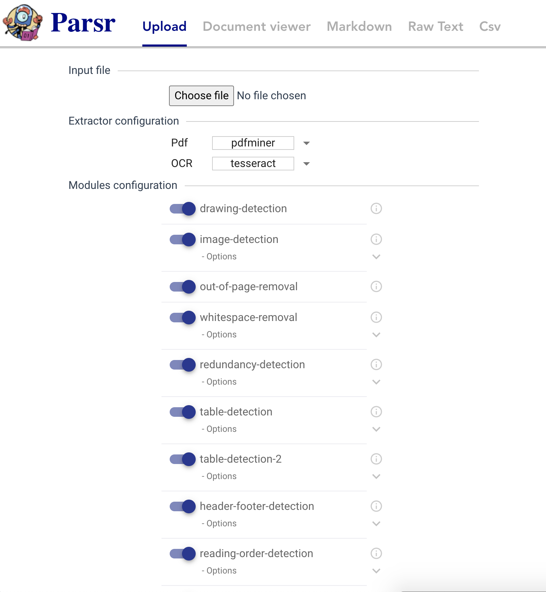
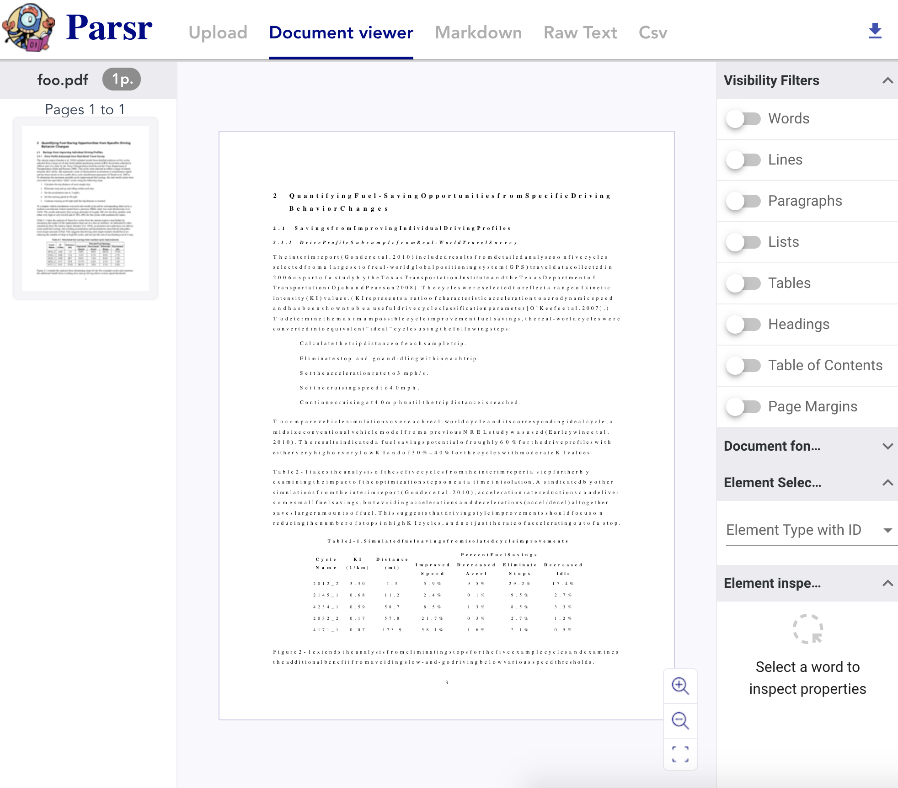
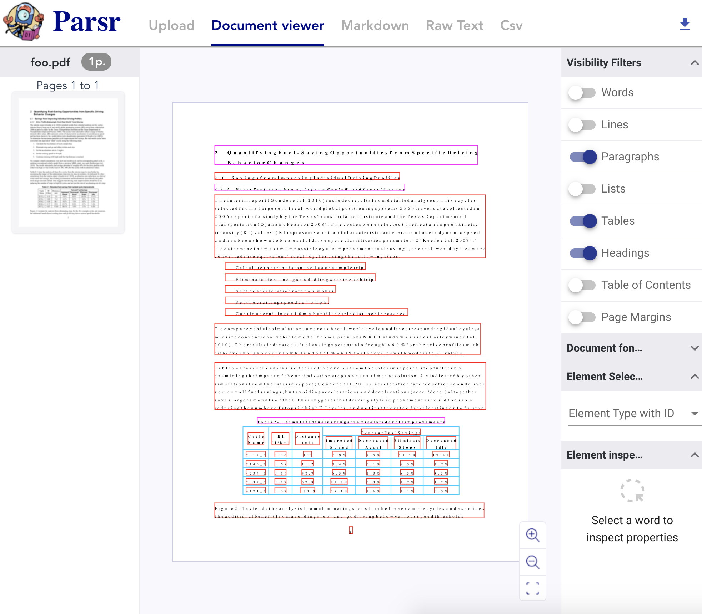
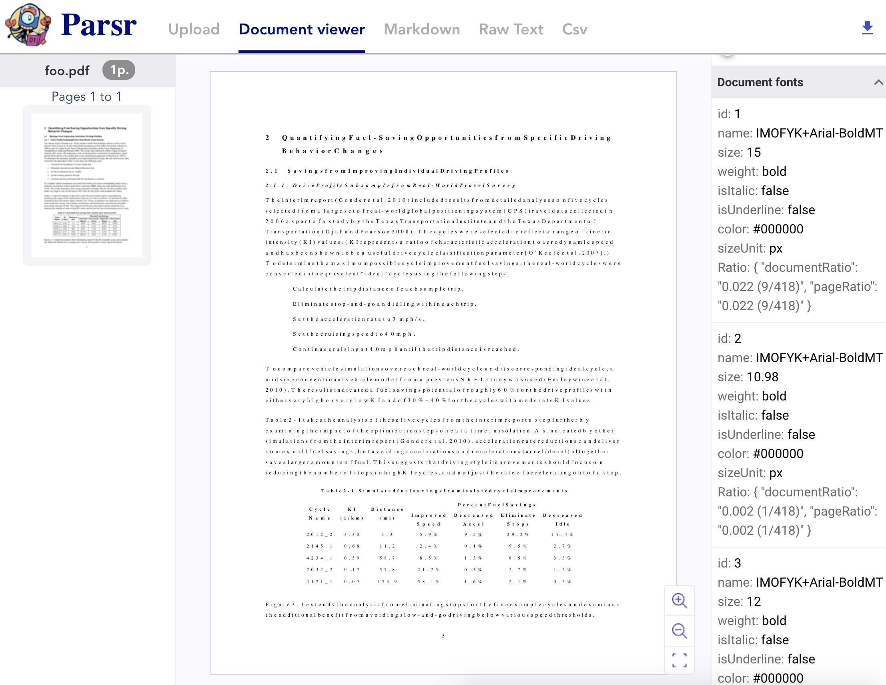
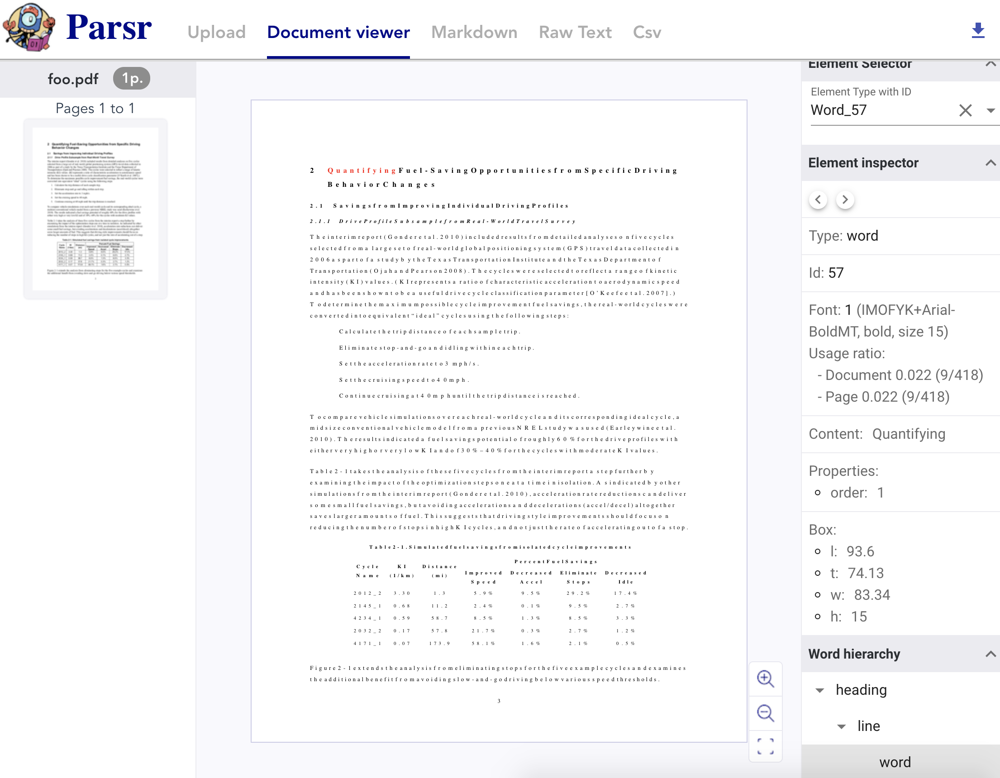
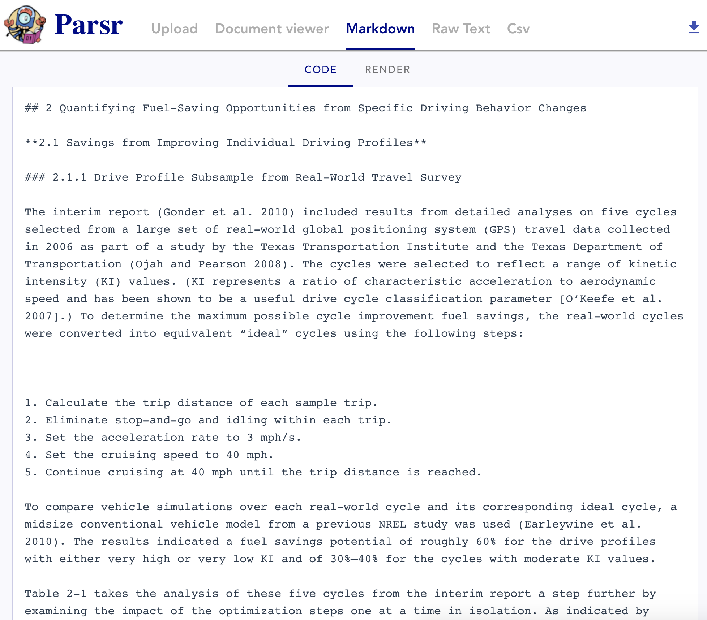
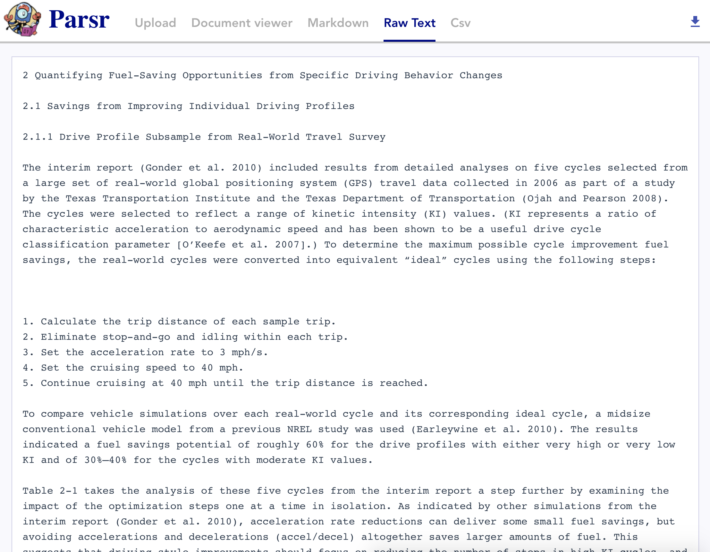
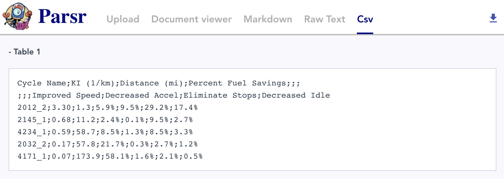
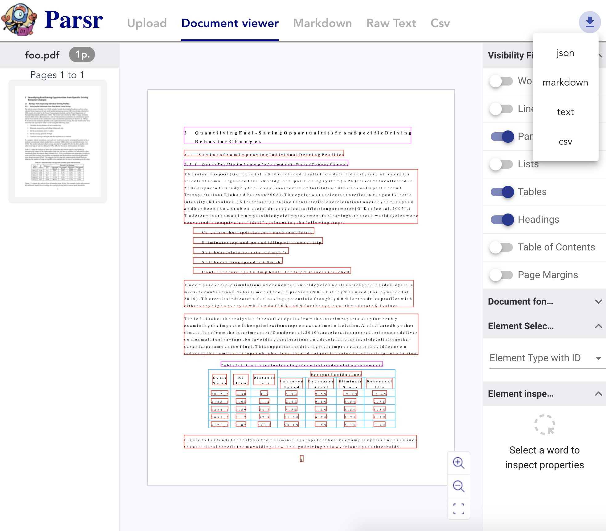

# GUI Guide

The Parsr GUI is intended for a quick visualization of the most used Parsr output formats: **json**, **markdown**, **raw text** and **csv**. Please note that **there are more output formats available**.

- [1. Upload a Document](#1-upload-a-document)
  - [1.1. Configuration](#11-configuration)
- [2. Visualize results](#2-visualize-results)
  - [2.1. JSON](#21-json)
    - [2.1.1. Visibility filters](#211-visibility-filters)
    - [2.1.2. Font inspector](#212-font-inspector)
    - [2.1.3. Element inspector](#213-element-inspector)
  - [2.2. Markdown](#22-markdown)
  - [2.3. Raw Text](#23-raw-text)
  - [2.4. CSV](#24-csv)
- [3. Download results](#3-download-results)

## 1. Upload a Document

To upload a document and start Parsr process, simply go to http://localhost:8080/ or click on the `Upload` tab if already there. Here you will be able to select an input file and the modules you want to execute.

### 1.1. Configuration

The available parameters on this screen are taken from the [default configuration file](../server/defaultConfig.json). 

Once you are ready, you can click on the `SUBMIT` button at the bottom of the page. Parsr process will start executing and a progress pop-up will be shown. Once it finishes, you will be redirected to the [JSON results](#21-json) tab.

**Note**: *Here you will be able to select an extractor for the file, as well to enable/disable modules and changing their default parameters. If you want to configure anything else, you will need to manually edit the configuration file and reload the page for the changes to be applied.*

## 2. Visualize results

The GUI has 4 output formats available for inspection, described below:

### 2.1. JSON

The most rich format, here you will find information about `words`, `lines`, `paragraphs`, `tables`, etc., its position relative to top-left corner of the page, a hierarchical structure of the blocks and more.
The JSON Parsr output will be interpreted and shown in a user-friendly way.

#### 2.1.1. Visibility filters

With the visibility filters you can enable/disable the containing bounding boxes of the elements. In the example figure, `headings` are marked on fuchsia, `paragraphs` are marked on red and `tables` are marked with light-blue.

#### 2.1.2. Font inspector

On the font inspector you will see information about every `font` on the document, with its properties and usage ratios.

#### 2.1.3. Element inspector

You can click on every word inside the document. It will turn red and information about that element will be shown on the element inspector. Here you can move between elements of the same type by clicking on the next / previous buttons. Also you will font font information, contents of that element and properties of the element bounding box.
On the "Word hierarchy" section, you can click on the hierarchical parent of the selected element, and it will be highlighted on the page.

### 2.2. Markdown

Markdown result is a rich text document that defines `headings` and their level, `paragraphs`, `tables`, `lists`, `images`, etc. Block hierarchy can be partially reconstructed with this output. 

### 2.3. Raw Text

Plain-text version of the document containing no formats or bounding box information.

### 2.4. CSV

On the csv section, you will see a CSV (semicolon separated values) table with a unique identifier for each of the tables in the document.

## 3. Download results

If you want, you can also save this four output formats with the download button located on the top-right corner of the window.

