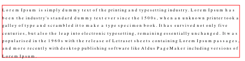

# Lines to Paragraph Module

## Purpose

Create paragraphs from a collection of lines.

## What it does

It creates new paragraph elements that contains arrays of line elements.

## Dependencies

[Words to Lines](words-to-line-module.md)
[Reading Order Module](reading-order-module.md)

## How it works

It simply takes every line one by one according to the reading order and stops and loops if the next line is on another paragraph.

## Parameters

1. `tolerance`: Ratio used when merging lines into paragraphs taking into account the line height and bottom distance to next line.

   **TIP**: If you see two lines in same paragraph that should be splitted into two paragraphs decrease tolerance value, if you see two lines in diferent paragraphs that should be part of same paragraph increase tolerance value.

- Tolerance 0.1
  

- Tolerance 0.25
  

2. `computeHeadings`: True/False.

   Computes the headings while merging lines into paragraphs. It is calculated by using the satisfaction of atleast one of the following criteria for a group of lines:

   1. Seperior font size to the most common font size in the document.
   2. **Entirely bold lines**
   3. Title Case presence across the entire line - with the presence of atleast one entirely non-numeric string token (a word).
   4. UPPER CASE presence acress the entire line - with the presence of atleast one entirely non-numeric string token (a word).

   The level of headings is decided based on font size differences - the lines with the largest fonts become superior level headings.

## Accuracy

Almost perfect

## Limitations

- It depends on the reading order detection quality
- To detect the space between paragraphs, it's currently using an heuristics and doesn't detect automatically according the the interline. So if a paragraph have a large interline spacing, the algo may fail and create one paragraph per line. That said, this rarely occures according to our experience.
